# 7.0 元DNA疗法家族 · 总览与知识图谱

> **日期**: 2026-07-03
> **范围**: 7.x 应用扩展系列总览 + 子文档索引 + 知识图谱
> **核心**: 凡是观察到"局部-整体映射"现象的疗法，都属于元DNA疗法家族

---

## 一、7.x 系列定位

| 系列 | 主题 | 性质 | 篇数 |
|------|------|------|------|
| **5.x** | 知识扩展 | 中医/神经科学现代连接 | 3 篇 |
| **6.x** | 物理学基础 | 理论 + 机制 + 工程 | 6 篇 |
| **7.x** | 应用扩展 | 元DNA疗法家族系统化 | 5 篇（本文为第 0 篇） |

**7.x 系列使命**：把分散在全球各地的 60+ 种元DNA相关疗法，整合为统一的**"元DNA疗法家族"**理论框架，并用 AI 时代的新工具（前沿方向）扩展其应用。

---

## 二、7.x 系列子文档索引

| 文档 | 主题 | 核心内容 | 字数 |
|------|------|---------|------|
| **7.0** | 总览 + 知识图谱 | 家族结构 + Mermaid 图 | ~4 KB |
| **7.1** | TCM/自然疗法映射 | 63 种疗法分类与全息符合度 | ~10 KB |
| **7.2** | 现代医学的全息现象 | Head's Zones / Dermatome / 牵涉痛 / CRPS | ~7 KB |
| **7.3** | 跨文化传统医学对照 | 中医 vs 阿育吠陀 Marma vs 藏医 | ~6 KB |
| **7.4** | 前沿方向 | 微针贴片 / 数字孪生 / 太空医学 | ~6 KB |
| **7.5** | AI Agent 全息架构 | HAIS 的元DNA理论根源 | ~5 KB |

---

## 三、元DNA疗法家族知识图谱（Mermaid）

```mermaid
graph TD
    Root["张颖清元DNA理论<br/>1981 创立"]

    Root --> Bio["生物学基础"]
    Root --> Theory["理论框架"]
    Root --> Family["疗法家族"]
    Root --> Frontier["前沿方向"]

    Bio --> Embryo["胚胎同源性<br/>4 周时每个体节含<br/>完整发育潜能"]
    Bio --> NeuralSeg["神经节段理论<br/>C1-S5 映射"]
    Bio --> DNA["DNA 全息<br/>每个细胞含完整基因组"]
    Bio --> Shannon["信息论<br/>8 微系统 SNR ≈ 56 dB"]

    Theory --> HolographicEmbryo["元DNA定义<br/>相对独立部分含整体信息"]
    Theory --> HolographicLaw["生物全息律<br/>身体节肢同构"]
    Theory --> BioFunc["穴位功能<br/>诊断 + 治疗"]
    Theory --> EmbryoIncl["泛胚性<br/>元DNA普遍存在"]

    Family --> TCM["传统中医"]
    Family --> Acupuncture["针灸穴位"]
    Family --> Western["西方自然疗法"]
    Family --> ModernMed["现代医学"]
    Family --> CrossCult["跨文化传统"]
    Family --> CrossSpecies["跨物种"]

    TCM --> Erl["耳穴疗法"]
    TCM --> She["舌诊"]
    TCM --> Mai["脉诊"]
    TCM --> Mian["面诊"]
    TCM --> SecMeta["第二掌骨"]
    TCM --> GuaSha["生物全息刮痧"]

    Acupuncture --> EyeNeedle["眼针"]
    Acupuncture --> Scalp["头皮针"]
    Acupuncture --> HandNeedle["手针"]
    Acupuncture --> SuJok["Su Jok 手足针"]
    Acupuncture --> BackShu["背俞穴"]
    Acupuncture --> Wrist["腕踝针"]

    Western --> Zone["Zone Therapy"]
    Western --> Reflexo["Reflexology"]
    Western --> Kinesio["Kinesiology"]
    Western --> EAV["Voll 电针"]
    Western --> CST["颅骶疗法"]

    ModernMed --> HeadZone["Head's Zones<br/>1893"]
    ModernMed --> Derma["Dermatome"]
    ModernMed --> Referred["牵涉痛"]
    ModernMed --> Trigger["Trigger Point"]
    ModernMed --> CRPS["CRPS"]
    ModernMed --> Scar["瘢痕干扰"]

    CrossCult --> Marma["阿育吠陀 Marma"]
    CrossCult --> Tibetan["藏医"]
    CrossCult --> Korean["韩医四象"]
    CrossCult --> Unani["Unani 医学"]

    CrossSpecies --> VetAc["兽医针灸"]
    CrossSpecies --> Zoopharm["动物自我药疗"]

    Frontier --> MicroNeedle["微针贴片"]
    Frontier --> DigitalTwin["数字孪生"]
    Frontier --> Drug["全息药物递送"]
    Frontier --> Space["太空医学"]
    Frontier --> Bionic["仿生机器人"]
    Frontier --> AIAgent["AI Agent 全息架构"]

    AIAgent --> HAIS["HAIS v0.1<br/>5 段种子 + 7 API"]
    AIAgent --> HoloAgent["HoloAgent v0.2.6<br/>数字元DNA"]

    HoloScan2["HoloScan 2.0<br/>8 微系统<br/>AI 时代集成"]
    Erl -.元DNA家族精华.-> HoloScan2
    She -.元DNA家族精华.-> HoloScan2
    Mai -.元DNA家族精华.-> HoloScan2
    Mian -.元DNA家族精华.-> HoloScan2
    SecMeta -.元DNA家族精华.-> HoloScan2
    Scalp -.元DNA家族精华.-> HoloScan2
    Trigger -.元DNA家族精华.-> HoloScan2

    ModernMed -->|现代医学证实| NeuralSeg
    TCM -->|临床验证| Theory

    classDef root fill:#c92a2a,color:#fff
    classDef bio fill:#ffd8a8
    classDef theory fill:#ffe066
    classDef family fill:#b2f2bb
    classDef modern fill:#a5d8ff
    classDef frontier fill:#d0bfff
    classDef holoScan fill:#ff8787,color:#fff

    class Root root
    class Bio,BioEmbryo,NeuralSeg,DNA,Shannon bio
    class Theory,HolographicEmbryo,HolographicLaw,Funct,EmbryoIncl theory
    class Family,TCM,Acupuncture,Western,CrossCult,CrossSpecies family
    class ModernMed,HeadZone,Derma,Referred,Trigger,CRPS,Scar modern
    class Frontier,MicroNeedle,DigitalTwin,Drug,Space,Bionic,AIAgent,HAIS,HoloAgent frontier
    class HoloScan2 holoScan
```



---

## 四、元DNA家族 4 大支柱

### 支柱 1 · 临床验证（中医 3000 年）

中医几千年临床观察，已形成完整的"舌-脉-面-耳"全息诊断体系 + "耳针-第二掌骨-刮痧"全息治疗体系。

### 支柱 2 · 现代医学证实（神经解剖学）

Dermatome / Head's Zones / 牵涉痛 = 现代神经解剖学已经实证的"局部-整体"映射。**这不是理论，而是解剖学事实**。

### 支柱 3 · 跨文化验证（趋同演化）

中医、阿育吠陀、藏医、韩医、Unani **独立起源**，但都发现了**相似的元DNA疗法** → 趋同演化（convergent evolution）。

### 支柱 4 · 跨物种验证（同源器官）

马/牛/狗/猫的穴位分布与人类**60-70% 重叠** → 同源器官发育保留原始信息。

---

## 五、5 级全息符合度（核心标尺）

| 等级 | 符合度 | 共同特征 | 代表疗法 |
|------|--------|---------|---------|
| **L5 经典** | ⭐⭐⭐⭐⭐ | 局部完整对应整体 | 耳针、第二掌骨、Su Jok、Reflexology、Head's Zones |
| **L4 强** | ⭐⭐⭐⭐ | 局部对应大部分 | 舌诊、面诊、头皮针、Zone、EAV |
| **L3 中** | ⭐⭐⭐ | 局部-整体关联 | Kinesiology、Trigger Point、CRPS、浮针 |
| **L2 弱** | ⭐⭐ | 整体调节但缺机制 | Reiki、Aromatherapy、Wim Hof |
| **L1 边缘** | ⭐ | 无明确机制 | 神秘主义能量疗法 |

---

## 六、HoloScan 2.0 的元DNA家族精华集成

HoloScan 2.0 的 8 微系统不是任意选择，而是 **60+ 种元DNA疗法家族的精华荟萃**：

```
┌─────────────────────────────────────────────────────────┐
│                HoloScan 2.0 · 8 微系统                  │
│            全球 60+ 种元DNA疗法精华集成                  │
└─────────────────────────────────────────────────────────┘

  中医几千年临床证据：
    耳（耳针 L5） ───┐
    掌（第二掌骨 L5）─┤
    舌（舌诊 L5） ───┤
    脉（脉诊 L5） ───┤
    面（面诊 L4） ───┼──→ HoloScan 2.0
                      │
  现代神经科学证据：  │
    头（EEG/头皮针 L4）┤
                      │
  西方反射疗法证据：  │
    足（足底反射 L5）─┤
    手（手反射 L4）──┘
```

**结论**：HoloScan 2.0 是**元DNA疗法家族的工程化集成**——把分散在全球各地的临床证据汇聚到一个 AI 系统中。

---

## 七、7.x 系列与其他系列的连接

```
6.0 物理学基础 ────→ 7.0 元DNA疗法家族 ────→ 8.0 HoloScan 2.0 商业化
   │                       │                          │
   ├─ 6.1 DNA 全息         ├─ 7.1 TCM/自然疗法        ├─ 4.2 商业构想
   ├─ 6.2 Shannon 信息     ├─ 7.2 现代医学全息        └─ HoloScan MVP 立项
   ├─ 6.3 神经节段         ├─ 7.3 跨文化对照
   ├─ 6.4 HoloScan 2.0     ├─ 7.4 前沿方向
   ├─ 6.5 突变检测         └─ 7.5 AI Agent 全息
   └─ 6.6 类器官验证
```

**6.x 给理论，7.x 给应用，8.x 给商业化**。

---

## 八、7.x 系列核心命题

> **元DNA不是中医独有，而是生物体的普遍特征。**
> 张颖清 1981 的贡献是为这个普遍特征提供**统一理论框架**。

---

## 九、构建进度（实时）

- [x] **7.0** 总览 + 知识图谱（本文）
- [x] **7.1** TCM/自然疗法映射（63 种疗法）
- [ ] **7.2** 现代医学全息现象
- [ ] **7.3** 跨文化传统医学对照
- [ ] **7.4** 前沿方向（微针 + 数字孪生 + 太空医学）
- [ ] **7.5** AI Agent 全息架构（HAIS 理论根源）

---

_本系列建立元DNA疗法家族的完整理论框架。下一步将分别深入每个子方向。_