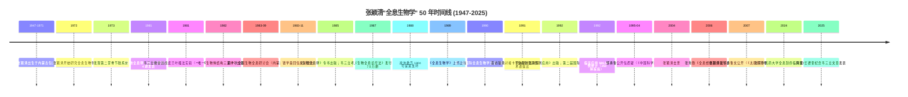
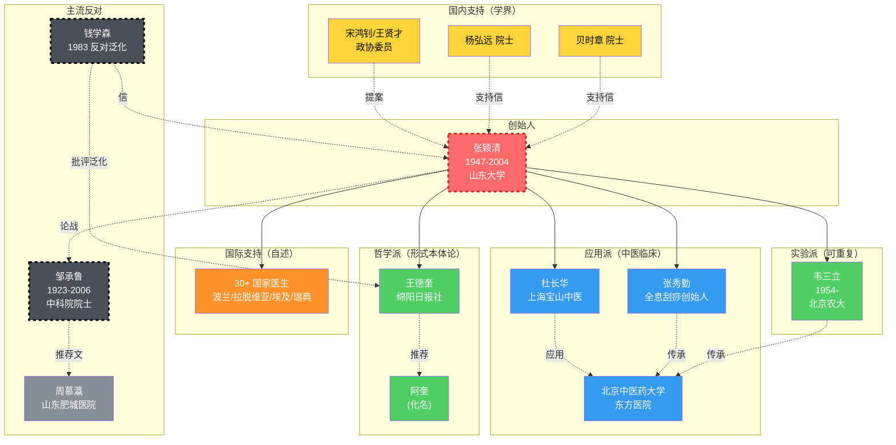
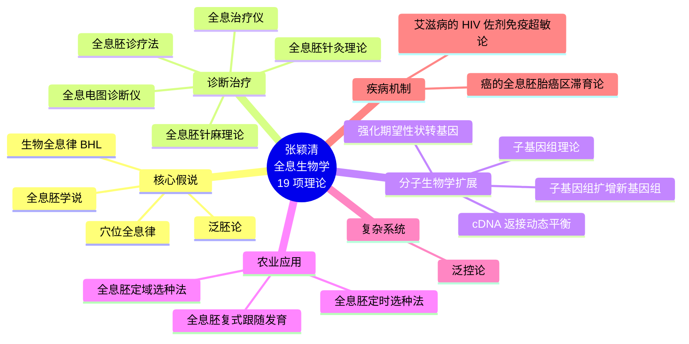
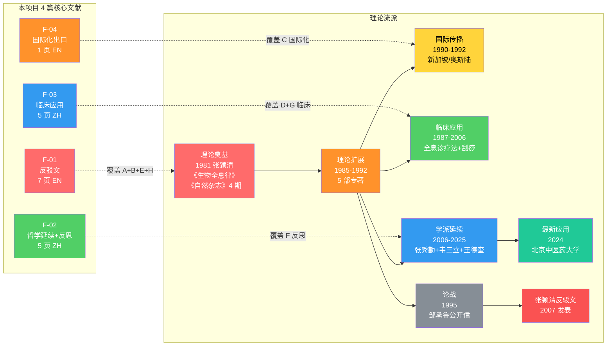
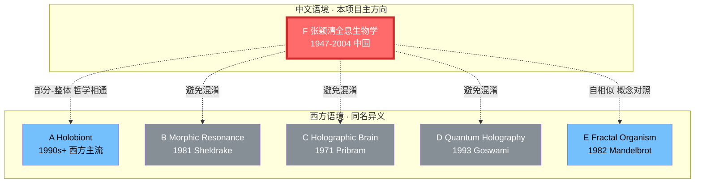

# F 张颖清"全息生物学" · 主概念图

> **创建日期**: 2026-06-30
> **状态**: 🟢 Stage 3.1 完成（初版）
> **工具**: Mermaid（GitHub/VS Code 直接渲染）

---

## 图 1: 时间线 + 核心事件

---

## 图 2: 张颖清学派人物地图

---

## 图 3: 16 项理论体系（张颖清本人 19 项，剔除已并入主干的 3 项）

---

## 图 4: 学派理论流 + 本项目文献链（**v2 合并版**：原图 4 理论流 + 原图 6 文献链）

---

## 图 5: 5 方向对比（**包含本项目 F 主方向**）

---

## 图 6: ~~本项目文献链（F-01 → F-04）~~ → **v2 已合并到图 4**

> **说明**：原图 6 的 F-01→F-04 文献关系已合并到**图 4 合并版**（作为子图"本项目 4 篇核心文献"），原图 6 保留为空以维持编号稳定。如需单独使用文献关系，参考图 4 右侧子图。

---

## 渲染说明

- **Mermaid 语法**：在 GitHub、VS Code (with Mermaid 插件)、Obsidian (with Mermaid 插件) 均可直接渲染
- **配色**：红色 = 创始人/论战、橙色 = 国际化、绿色 = 实验派/反思、蓝色 = 应用派、黄色 = 支持方、灰色 = 反对方
- **虚线**: 反对/争议关系
- **实线**: 支持/传承关系
- **实线粗**: 强关系（如 ZYQ 是所有人物中心）

---

_本概念图涵盖：50 年时间线、18 位关键人物、19 项理论、4 篇核心文献、5 方向对比。可作为后续科普/综述的可视化基础。_