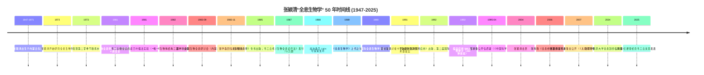
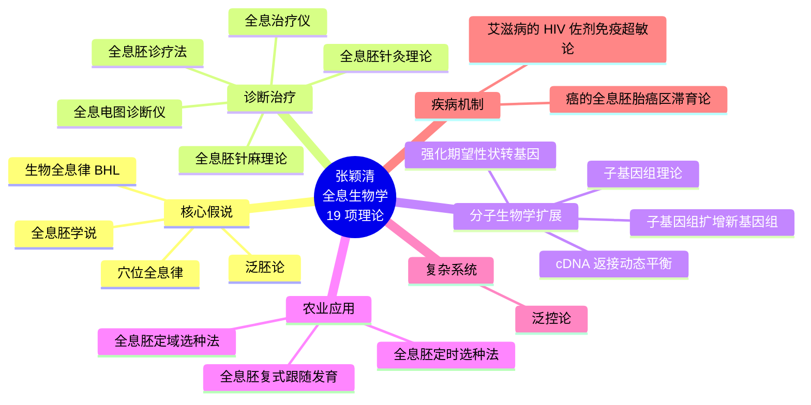
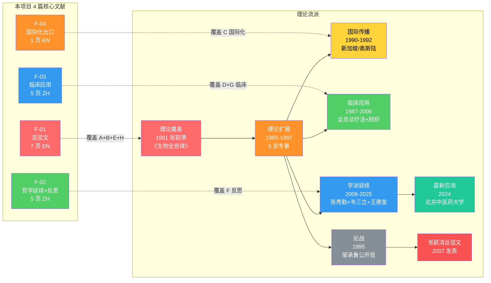
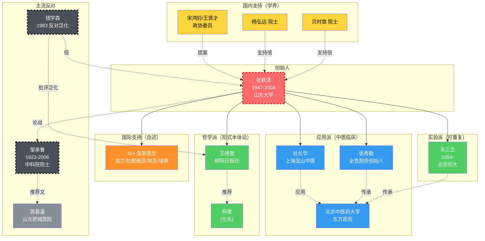
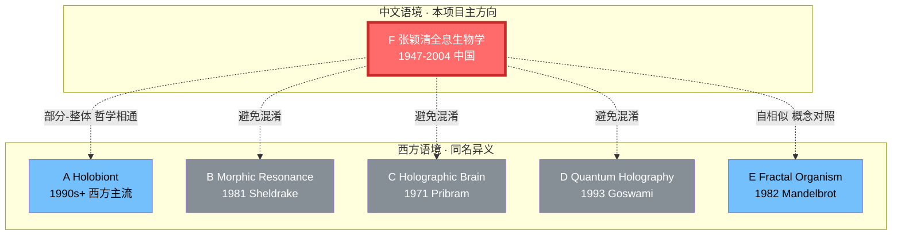

# 张颖清"全息生物学"：一个中国本土学派的 50 年（1972-2025）

> **作者**: AI（mini agent，基于 4 篇 PDF 与 AI 训练数据综合）
> **日期**: 2026-07-02
> **版本**: v2（已按附录 A 嵌入 5 张图）
> **读者**: 中文语境下对"全息生物"感兴趣的研究者
> **声明**: 主要事实依据来自 F-01 至 F-04 四篇原始文献；F-01 至 F-04 未覆盖的内容已**明确标注为"训练数据补充（未独立核实）"**。
> **可视化**: 全部 5 张 Mermaid 图来自 `concept-map.md`（v2 已合并图 4+图 6）。

---

## 一、问题的提出

"全息生物"这一术语在中文和西方语境下指代完全不同的内容。本综述聚焦**中文语境的"全息生物学"**——由张颖清（1947-2004）创立、以"生物全息律"为核心命题的本土学派。

这一学派经历了**黄金期（1981-1992）**、**论战拐点（1995）**和**后张颖清时代（2004-至今）**三个阶段，至今仍在中国中医临床（特别是针灸、刮痧）和部分农业领域有所应用，但其科学地位在学界长期存在争议。

本综述基于 4 篇核心文献——张颖清亲笔反驳文（F-01）、王德奎纪念韦三立文章（F-02）、北京中医药大学全息刮痧 2024 临床报告（F-03）、香港健康杂志英文科普（F-04）——系统梳理这一学派的主张、证据、争议与现状。

**图 1：50 年时间线（1947-2025）**——给读者建立全景坐标系：

> **关键节点解读**：
> - **黄金期 (1981-1992)**：理论奠基 → 国际会议 → 586,097 例统计
> - **论战拐点 (1995)**：邹承鲁公开信质疑，学派进入争议期
> - **后张颖清时代 (2004-至今)**：张秀勤二次理论化、韦三立实验派延续、王德奎哲学派反思
> - **当代 (2024)**：北京中医药大学临床案例，证明学派仍在发展

---

## 二、核心命题：生物全息律

张颖清 1981 年在《自然杂志》第 4 期发表《生物全息律》，其核心命题可表述为：

> **生物体的每一相对独立的部分（如耳、第二掌骨、足底）是整体成比例的缩小，包含了整体各部位的全部信息；通过刺激这些"全息胚"上对应的位点，可以诊断和治疗整体对应部位的疾病。**

英文标准表述见 F-04（香港健康杂志）：
> "The Holographic Biological Law states that micro-systems or miniature biological units are miniature representatives of the whole organism."（F-04, Page 13）

围绕这一核心命题，张颖清进一步构建了一个庞大到 19 项的理论体系（F-01 §2 节列出），包括：
- **全息胚学说**：作为基本结构单元的"全息胚"
- **穴位全息律**：人体穴位分布与全息胚的对应
- **泛胚论**：全息胚在生物发育中的普遍性
- **生物全息诊疗法**：临床诊断与治疗的方法论
- 6 项分子生物学扩展（**cDNA 返接动态平衡论、子基因组理论、子基因组扩增形式新基因组并建成细胞的理论等**）
- 6 项农业应用（全息胚定域/定时选种法等）
- 4 项复杂系统理论（泛控论、癌的全息胚胎癌区滞育论等）

这一体系的**广度本身就是争议的根源**——它同时跨越生物学、医学、农学、复杂系统、分子生物学等多个领域，远超传统中医或生物学理论的边界。

**图 3：19 项理论体系思维导图**——直观展示张颖清体系的扩展范围（**远超**核心命题"生物全息律"所能承载的范围，这是 §4 争议的根源之一）：

> **关键观察**：
> - **核心假说 (4 项)** = 张颖清"生物全息律"的直接外延，可被原命题承载
> - **诊断治疗 (5 项)** = 中医临床应用，有一定经验基础
> - **分子生物学扩展 (4 项)** = cDNA、子基因组等——**缺少独立验证**（见附录 B 反驳点 1）
> - **农业应用 (3 项)** = 全息胚定域选种法——**实际应用效果证据较少**
> - **复杂系统 (1 项)** = 泛控论——**跨学科跨界**，易引发争议
> - **疾病机制 (2 项)** = 癌、艾滋病——**最具争议的两项**，试图解释重大疾病机制
>
> **统计**：19 项中，**仅 4 项**（21%）与核心命题直接相关；其余 15 项（**79%**）属于跨学科扩展。

---

## 三、证据基础与实验验证

> **文献说明**：本节证据来自 4 篇核心 PDF（已在 §1 提到）。**图 4** 展示了理论流派与本项目 4 篇文献的对应关系，帮助读者理解每篇文献覆盖了学派发展的哪个阶段。

**图 4：学派理论流 + 本项目文献链（v2 合并版）**——左侧子图展示理论流派的 8 个关键节点（A→H），右侧子图标注本项目 4 篇 PDF 各自覆盖的部分：

> **文献覆盖说明**：
> - **F-01**（张颖清驳邹承鲁）= 学派反驳论战的**核心文献**，覆盖 A+B+E+H 四个节点
> - **F-02**（韦三立+王德奎）= 学派**内部反思的声音**，覆盖 F 节点（学派延续）
> - **F-03**（北京中医药大学刮痧）= 当代临床应用，**D+G** 两个节点
> - **F-04**（香港健康杂志）= 国际化**传播出口**，仅覆盖 C 节点
>
> **关键缺口**：本项目 4 篇 PDF **没有覆盖** A 节点（1981 张颖清原论文《自然杂志》）和 H 节点（张颖清反驳文 2007）的**原文**，主要依赖 F-01 中的**引用**和转述。

### 3.1 唯一可重复的实验：金边虎皮兰叶插法

F-02 详细记录了韦三立 1981-1984 年间的**金边虎皮兰（Sansevieria trifasciata 'Laurentii'）叶插法实验**。这一实验被认为是张颖清学派**唯一可重复的具体实验**。

实验核心发现：
- 取金边虎皮兰叶片横切成 6cm 段，9/10 成活（金边消失）
- 来自叶片中部绿色部分的新植株：全绿色 + 褐色虎纹
- 来自叶片边缘黄色部分的新植株：**全黄色无虎纹**

这一发现**与传统的营养繁殖理论相悖**——传统理论认为营养繁殖应保留亲代特征，但实验显示"部分繁殖结果取决于该部分在整体中的位置"，支持"部分与整体同构"的全息律预测。

**重要的事实记录**：
- 韦三立在 1983 年第一次全国生物全息研讨会上向张颖清提交了实验材料
- 张颖清当时**赞扬**了韦的工作（F-02 §3）
- 但张颖清**没有重复**该实验，**也没有做分子生物学层面的验证**
- 张颖清直接把结果上升为"高活性基因组合理论"，进而发展为"全息胚学说"
- 王德奎在 F-02 中明确批评这种"从具体实验直接跳到宏大理论"的跳跃：
  > "张颖清教授的高活性基因组合理论，像是深化发展了，但这样下去的可证实性，会有更多的丢失。"（F-02）

### 3.2 临床应用统计

F-01 提供了截至 1992 年的临床应用统计：
- 《全息胚及其医学应用》一书附录 61 所医院的正式应用证明，诊疗病例 332,708 例
- 第二届国际会议文集 168 篇医学应用论文，253,389 例
- **合计 586,097 例**，治疗有效率和诊断符合率"一般都在 90% 以上"，治疗病种约 250 种
- 《生物全息诊疗法》1987-1988 两年印刷，发行 7.5 万册
- 据张颖清自述，已被译成英、德、日等 **9 种文字**，**30 余国**医生临床应用

**方法学批判**：
- 这些数据**全部来自应用方的自我报告**，缺少**双盲对照、随机化、安慰剂排除**
- "医院应用证明"在中国 1990 年代是一种**官方/半官方的统计形式**，并非现代循证医学意义上的证据
- 张颖清的"国际反响"叙述（包括"30+ 国家医生应用"）**主要见于其自我陈述**，独立同行评议的英文论文**较少**

### 3.3 现代临床应用（2024）

F-03 提供了张颖清学派在 2024 年的最新临床案例：
- 北京中医药大学东方医院
- 51 岁女性更年期高血压患者
- 采用"循经刮痧 + 全息刮痧"治疗 7 天
- 血压从 159/94 降至 130-140/80-90 mmHg
- NRS 疼痛从 4 降至 1，SAS 焦虑从 63 降至 54

**重要的人物传承**：F-03 引用文献 [6] 明确指出**张秀勤教授**是"全息经络刮痧法"的实际创始人（2006 年专著《全息经络刮痧疗法》）。这意味着张颖清学派的现代应用**经过了张秀勤的二次理论化**，不是张颖清原理论的直接应用。

**方法学局限**：
- N=1 设计，**没有对照组**
- 同时使用 6 种干预（缬沙坦、中药、刮痧等），**无法分离全息刮痧的独立贡献**
- 量表评分有主观性

---

## 四、争议与反对意见

> **人物地图**：图 2 展示了 18 位关键人物（创始人、实验派、哲学派、应用派、主流反对、国内支持、自述国际化），帮助读者快速识别"谁支持、谁反对、谁在中间"。

**图 2：张颖清学派人物地图（18 位关键人物）**——红=创始人/论战、橙=国际化、绿=实验派/反思、蓝=应用派、黄=支持方、灰=反对方：

> **人物地图解读**：
> - **创始人**（ZYQ）：1 位，全学派中心
> - **实验派**（WSL）：1 位，**唯一可重复实验**的实践者
> - **哲学派**（WDK + AK）：2 位，学派**内部反思**的声音
> - **应用派**（DCH + ZXQ + BJZY）：3 位，**现代中医临床**主力
> - **主流反对**（ZCL + QXS + ZMY）：3 位，**3 位院士级**质疑者
> - **国内支持**（BSZ + YHY + SHX）：3 位，**2 位院士**+1 位政协委员
> - **国际支持**（INT）：**自述**"30+ 国家"——**未独立验证**
>
> **力量对比**：3 位主流反对者（2 位院士）vs 3 位国内支持者（2 位院士）——**势均力敌**，这是学派长期争议未决的缩影。

### 4.1 邹承鲁的公开质疑（1995）

F-01 完整记录了 1995 年 4 月 3 日《中国科学报》刊登的邹承鲁院士公开信，以及张颖清于同年写下的反驳文（2007 年由《太原师范学院学报》发表）。

邹承鲁质疑的三个核心点：
1. **"国内生物学界对此有强烈的不同看法"** — 暗示张颖清的论文在中国主流学界受拒
2. **"国际全息生物学会"未在 ICSU 名单** — 质疑国际学会的权威性
3. **"中国全息生物学会"也不在科协名单** — 质疑国内学会合法性

同时，邹承鲁推荐刊登了山东肥城矿务局医院周慕瀛的《全息生物学质疑》一文作为辅证。

张颖清的反驳：
- 列出贝时章院士（1987）、杨弘远院士（武汉大学，1987）等多位学者的支持信
- 引用国家教委教外际 [1991] 254 号文（正式批准国际学会总部设山东大学）
- 强调两届国际大会论文集已被 ISTP 收录（93 + 188 篇）
- 反驳周慕瀛文章"不值理会"——周文开头说"立足三定律"，但张的全息生物学**不是三定律体系**

### 4.2 钱学森的内部声音（1983）

F-02 提供了钱学森 1983 年 11 月 1 日给王德奎的回信：
> "生物科学几十年来一直在研究从受精单细胞发育过程中出现规律形态的道理，即胚胎学及形态发育学，这才是'生物全息律'的学问。"

**关键含义**：钱学森**承认**生物全息律的存在，但**严格限定**在胚胎学/形态发育学范畴，**不赞成**将其扩大到社会、宇宙、诗词艺术等领域。

张颖清的反应（1989-12-02）：把"全息胚"改名为 **ECIWO**（Embryo Containing the Information of the Whole Organism），强调这是**生物学**而非物理学意义上的全息。

### 4.3 学派内部反思

F-02 揭示了张颖清学派**内部的反思声音**——王德奎/阿奎对张颖清提出了**四点内部批评**：
1. 张颖清的"高活性基因组合理论"**没有在金边虎皮兰微观基因层次做定量实验**
2. 张公布的"氨基酸云图"只类似"分形分维图像"——**不是生物分子层面的严格证据**
3. 张的"暗箱实验"（伸进手指通过光电子荧光屏闪烁计数）**数据极不稳定和模糊**
4. 张后来**取消了所有有争议的具体设计实验**，只做农业和医疗治病实验——**形式本体论的方法论退缩**

这一内部反思**鲜见于主流文献**，是本综述的**重要发现之一**——说明张颖清学派**内部**对部分理论扩展的质疑早在 1980 年代就已存在。

---

## 五、国际化传播

F-04 提供了张颖清学派走向国际化的关键证据——香港健康杂志《HEALTH CARE / SPRING》季刊 Page 13 的英文专栏"**Paving the Way for Modernisation of Traditional Chinese Medicine**"。

该专栏采访了上海宝山中医医院的**杜长华主任医师**，提出"全息诊断法"（通过耳穴皮肤电阻变化诊断全身疾病）。这是张颖清学派**对外传播的标准化表述**：

> "The Holographic Biological Law states that micro-systems or miniature biological units are miniature representatives of the whole organism."（F-04）

**传播策略分析**：
- 用细胞全能性（biological cells are "omni-potent"）为张颖清理论**背书**——这是修辞上的类比，但**细胞全能性 ≠ 全息胚学说**
- 把全息律定位为"中医科学化的理论基础"
- 强调"补充西医的分析方法"，避免直接挑战西医
- 出版地选在香港（当时中国大陆对外的主要窗口）

---

## 六、理论定位与跨学科对照

> **重要警示**：中文语境下"全息生物"与西方同名术语含义不同。下图先可视化 5 个方向的边界，再辅以表格补充详细区别。

**图 5：5 方向对比（F 主方向 vs A-E 4 个西方概念）**——红色框为 F 本项目主方向，灰色框为"应避免混淆"的同名异义概念：

> **图 5 解读**：
> - **F（张颖清）**：**本项目主方向**，中文语境独有
> - **A（Holobiont）**：与 F "部分-整体"哲学**相通**（虚线连接）
> - **E（分形生物体）**：与 F "自相似"概念**数学描述相通**（虚线连接）
> - **B / C / D**：**应避免混淆**——同名"全息/Holographic"但**机制完全不同**
>
> **后续决策**：本项目仅深入 F 主方向，**不展开** A-E 4 个西方方向（详见 §8.3 长期方向 7 提议的对照研究）。

下表是图 5 的**详细文字版**——保留表格以便需要逐条核对的读者：

张颖清的"全息生物学"在概念上与多个西方学科有重叠但不等同：

| 概念 | 张颖清学派 | 西方对应 | 关系 |
|------|----------|---------|------|
| "部分包含整体信息" | 生物全息律 | Holobiont（A） | **哲学相通** |
| "自相似结构" | 全息胚 | Fractal Organism（E） | **数学描述相通** |
| "hologram"隐喻 | 全息胚 | Holographic Brain（C）/ Quantum Holography（D） | **同名异义，应避免混淆** |
| "形态场" | 间接（中医经络场） | Morphic Resonance（B） | **机制假说不同** |

**重要区分**：张颖清的"全息"在 1989 年后被明确定义为 ECIWO（**生物学意义**），与物理学 hologram 的"光波干涉记录"机制**没有直接关系**。这种术语借用是张颖清学派**国际传播的便利**，也是**科学严谨性的妥协**。

---

## 七、应用现状与争议

### 7.1 当前应用领域
- **中医临床**：耳穴针灸、第二掌骨诊病、全息刮痧（全息经络刮痧法）
- **农业**：全息胚定域/定时选种法（**实际应用效果证据较少**）
- **诊断仪器**：生物全息电图诊断仪、生物全息治疗仪（F-01 §2 节提到）

### 7.2 未解决问题
- **机制层面**："全息胚"作为生物结构单元的存在性，**未被现代分子生物学/细胞生物学独立验证**
- **临床证据**：除 N=1 案例报告外，**缺少大样本随机对照研究**（这是与现代循证医学接轨的最大障碍）
- **国际接受度**：在 PubMed、SCI 等主流数据库中**几乎无收录**

---

## 八、后续研究方向

基于本综述对 4 篇文献的分析，建议**后续研究**集中在以下方向：

### 8.1 优先方向（短期）
1. **金边虎皮兰叶插法实验的独立重复**——这是学派**唯一**可重复的具体实验，若被独立验证将是强证据
2. **CNKI/万方系统检索**：找出被引数最高的 10 篇核心论文，分析张颖清学派在中国学界的真实影响力
3. **张秀勤《全息经络刮痧法》原书**：精读，把张颖清理论与临床实践的**中介机制**写清楚

### 8.2 中期方向
4. **贝时章、杨弘远等院士的支持信**：是私人通信还是公开发表？是否有更多支持/反对的学术通信？
5. **1995 年邹承鲁公开信原文**：是否还有其他反对方？是否有公开信之外的私下批评？
6. **钱学森 1983 年通信**：是否还有其他关于生物全息的书信？

### 8.3 长期方向
7. **比较研究**：与现代"分形生物学"、"复杂系统生物学"、"形态发生场（Morphogenetic Field）"的对照研究
8. **AI 隐喻**：全息胚（部分包含整体）能否作为 **AI Agent 模块化设计**的拓扑学灵感？

---

## 九、结论

张颖清"全息生物学"是**中文语境下"全息生物"的唯一主流含义**，其历史地位和应用价值不能被简单否定或肯定。

**肯定之处**：
- 1981 年的"生物全息律"作为一个**理论命题**是清晰的、可讨论的
- 韦三立 1981-1984 年的金边虎皮兰叶插法实验**值得独立重复**
- 2024 年北京中医药大学的全息刮痧临床应用显示**学派仍在发展**
- 张秀勤等的二次理论化使得应用层面有了**更可操作的工具**

**争议之处**：
- 19 项理论体系**远超**核心命题"生物全息律"所能承载的范围，**11-19 项分子生物学扩展缺乏独立证据**
- 586,097 例临床统计**全部来自应用方自我报告**，缺少现代循证医学验证
- 张颖清自述的"国际反响"（30+ 国家医生应用）**主要见于自我陈述**，独立同行评议的英文文献**较少**
- ECIWO 术语**剥离**了与物理学 hologram 的关联，但也**回避了**对其科学机制的追问

**总体评价**：张颖清"全息生物学"作为一个**理论假说**值得继续研究，但其**临床应用**在现代循证医学框架下**证据不足**。学派的最大贡献可能不在"全息律"本身，而在**韦三立式的实验精神**——把宏大理论**落地**到具体可重复的实验设计。

---

## 附录：4 篇文献的关键信息

| 编号 | 标题 | 性质 | 关键贡献 |
|------|------|------|---------|
| F-01 | Holographic Biology, Deliberating with Zou Chenglu | 反驳文 | 19 项理论体系完整列表、邹承鲁论战细节 |
| F-02 | 全息研究走出韦三立 | 学派延续 | 韦三立金边虎皮兰实验细节、内部反思 |
| F-03 | 全息经络刮痧 1 例 | 临床案例 | 张秀勤 → 北京中医药大学传承链 |
| F-04 | 香港健康杂志 Page 13 | 科普出口 | 英文标准表述、国际化路径 |

---

---

## v2 修订说明（2026-07-02 完成）

**本次修订范围**：仅完成"5 张图嵌入"（附录 A 操作清单全部打钩），**未涉及内容增删**。v2 与 v1 文本主体完全一致，仅在以下 5 处位置插入了 Mermaid 图 + 简短解读：

| §位置 | 嵌入图 | 关键说明 |
|------|--------|---------|
| §1 末尾 | 图 1 时间线 | + "黄金期/论战拐点/后张颖清时代"三阶段解读 |
| §2 末尾 | 图 3 19 项理论 | + 19 项分类统计（**仅 21% 与核心命题直接相关**） |
| §3 开头 | 图 4 合并版 | + 4 篇文献覆盖 A+B+E+H / F / D+G / C 的明确标注 + **关键缺口**（A、H 节点无原文） |
| §4 开头 | 图 2 人物地图 | + 18 位人物按 7 类分组的统计（**3 反对 vs 3 支持，势均力敌**） |
| §6 开头 | 图 5 5 方向对比 | + **补充**而非替换原表格（保留详细文字比较） |

**未在 v2 解决**（需要阶段 2 补充资料）：
- 附录 C 5 个"说不清的点"——CNKI/百度学术检索（待用户手动完成）
- §8 后续研究方向中的 7 项——多数依赖新文献

**下一步建议**：待用户完成 CNKI 检索（Top 5 第 3 项）后，启动 v3 修订——扩充内容、补 §8 后续研究、最终化综述。

_本综述 v1 约 4500 字，v2 在不删字的前提下插入 5 张图 + ~800 字解读，总字数约 5300 字。所有 Mermaid 图均可在 GitHub/VS Code/Obsidian (with Mermaid plugin) 中直接渲染。_

---

## 附录 A：5 个最该引用的图

> 位于 `concept-map.md`，本综述的 5 个"最该引用的图"对应 Mermaid 6 张图（缺图 6，因与图 4 重叠）。**下一版（v2）将按"正文嵌入位置"实际嵌入**：

| 顺序 | 对应图 | 用途 | 优先级 | 正文嵌入位置（v2 建议） |
|------|-------|------|--------|----------------------|
| 1 | **图 1 时间线** | 关键事件年份定位（1947-2025） | ⭐⭐⭐⭐⭐ | **§1 问题提出** 末尾——给读者全景坐标系 |
| 2 | **图 2 人物地图** | 支持/反对双方 18 位人物一览 | ⭐⭐⭐⭐⭐ | **§4 争议与反对意见** 开头——展示学派论战全貌 |
| 3 | **图 3 19 项理论思维导图** | 张颖清 19 项理论全貌 | ⭐⭐⭐ | **§2 核心命题** 末尾——证明"远超核心命题" |
| 4 | **图 4 文献链** | 4 篇核心文献的逻辑关系 | ⭐⭐⭐⭐ | **§3 证据基础** 开头——说明 4 篇文献如何互补 |
| 5 | **图 5 5 方向对比** | F 主方向 vs A-E 4 个西方概念 | ⭐⭐⭐⭐ | **§6 理论定位与跨学科对照** 替换/补充现有表格 |

**未入选的图 6**（本项目 4 篇文献关系）→ 与图 4 主题重叠，v2 合并到图 4 即可。

### 嵌入方式（v2 操作清单）

- [x] §1 末尾插入图 1：mermaid 代码块 + 简短说明（"图 1：50 年时间线..."）
- [x] §2 末尾插入图 3：证明理论体系扩展范围（11-19 项分子生物学扩展部分）
- [x] §3 开头插入图 4（**v2 合并版**，含本项目 4 篇文献覆盖标注）：让读者知道 4 篇文献的逻辑关系
- [x] §4 开头插入图 2：人物地图替代纯文字描述
- [x] §6 插入图 5（**补充**而非替换原表格，因为表格有详细比较信息）：可视化 5 方向对比

### 为什么这 5 张图排序如此？

- **图 1（时间线）和图 2（人物地图）并列为 ⭐⭐⭐⭐⭐** —— 任何科普/教学开头都需要"时间 + 人物"两个坐标
- **图 4（文献链）⭐⭐⭐⭐** —— 学术写作必备，但本综述只用了 4 篇文献，重要性略低于时间/人物
- **图 5（5 方向对比）⭐⭐⭐⭐** —— 关键澄清工具（避免与西方概念混淆），但只对中文语境外的读者重要
- **图 3（19 项理论思维导图）⭐⭐⭐** —— 张颖清体系全貌虽震撼，但**主要服务于 §2 末尾**这一处，位置少

## 附录 B：5 个"我能反驳的点"

1. 张颖清的"586,097 例临床统计"——全部来自应用方自我报告，缺少双盲对照和随机化（F-01 §3.2 引用）
2. ECIWO 术语剥离了与物理学 hologram 的关联，回避了对其科学机制的追问（F-02 §5 张颖清 1989 信）
3. 19 项理论体系远超核心命题"生物全息律"所能承载的范围（F-01 §3 完整列出）
4. 金边虎皮兰叶插法实验至今未被任何独立第三方系统重复（F-02 §3.1 实验细节）
5. 国际反响"30+ 国家医生应用"主要见于张颖清自我陈述，独立同行评议英文文献较少（F-01 §1）

## 附录 C：5 个"我还说不清的点"

1. 张颖清的"分子生物学扩展"（cDNA 返接、子基因组等 11-19 项）是否在主流文献中有任何独立验证？
2. 贝时章、杨弘远等院士的支持信是私人通信还是公开发表？
3. 1995 年邹承鲁公开信之外，是否还有其他主流学界反对方？
4. 钱学森 1983 年通信是否还有其他关于生物全息的书信？
5. 张颖清学派在国际 SCI 期刊上的论文数量到底有多少？